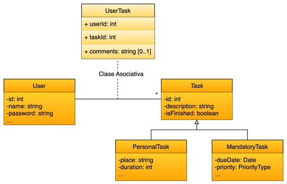

<div style="text-align: center;">
  </div>

# Task Manager API

## Descripción del proyecto

TaskMan es una API RESTful desarrollada con Java y Spring Boot que permite la gestión de tareas personales y obligatorias. El sistema incluye autenticación mediante JWT, control de acceso basado en roles (`ADMIN`, `USER`, `MANAGER`), y permite a los usuarios gestionar sus propias tareas de forma segura y eficiente.

Los usuarios pueden:
- Registrarse e iniciar sesión.
- Crear, listar, completar y eliminar sus propias tareas personales.
- Crear, listar y gestionar tareas obligatorias (Mandatory Tasks).
- Visualizar tareas de su propiedad (o según su rol en determinados casos).

---

## Diagrama de clases


<div style="text-align: center;">
  
</div>


Existen dos clases principales, `Task` y `User`, que representan las entidades del sistema. La clase `Task` tiene dos subclases: `PersonalTask` y `MandatoryTask`, cada una con sus propias propiedades y métodos.

- `User`
    - id
    - username
    - password
    - role

  ---------
El proyecto sigue una estructura de herencia entre entidades:

- `Task` (superclase abstracta)
    - id
    - description
    - isFinished


- `PersonalTask` (subclase de Task)
    - …
    - duration
    - place
  

- `MandatoryTask` (subclase de Task)
    - …
    - assignedTo
    - startDate
    - dueDate
    - priority

Por último, la clase asociativa `UserTask` modela la relación entre los usuarios y las tareas.

- `UserTask` 
    - id
    - userId
    - taskId
    - comments


Relaciones:
- `User` 1---* `UserTask` (One-to-Many)


- `Task` 1---1 `UserTask` (One-to-One)


---

## Setup (Instalación local)

1. **Clonar el repositorio**
   ```bash
   git clone https://github.com/dsuarezg/TaskManager.git
   cd TaskManager
   ```

2. **Configurar base de datos (MySQL)**  

        Crear una base de datos llamada `task_manager` en MySQL.


3. **Configuración recomendada de application.properties**
   ```properties
    spring.application.name=task-manager
    
    spring.security.user.name=[tu_usuario]
    spring.security.user.password=[tu_contraseña]
    
    spring.datasource.url=jdbc:mysql://localhost:3306/task_manager
    spring.datasource.username=[tu_usuario]
    spring.datasource.password=[tu_contraseña]
    spring.datasource.driver-class-name=com.mysql.cj.jdbc.Driver
    
    spring.jpa.properties.hibernate.transaction.coordinator_class=jdbc
    spring.jpa.properties.hibernate.transaction.jta.platform=org.hibernate.engine.transaction.jta.platform.internal.NoJtaPlatform
    spring.jpa.hibernate.ddl-auto=update
    spring.jpa.open-in-view=false

   ```

4. **Construir el proyecto**
   ```bash
   mvn clean install
   ```

5. **Levantar el servidor**
   ```bash
   mvn spring-boot:run
   ```

6. **Acceder a Swagger (Documentación API)**
   ```
   http://localhost:8080/swagger-ui/index.html
   ```

---

## Tecnologías usadas

- Java 17
- Spring Boot 3
- Spring Security
- Spring Data JPA
- JWT (JSON Web Tokens)
- MySQL
- Maven
- Swagger / OpenAPI 3
- Lombok
- Postman
- JavaScript (scripts de Postman)
- JUnit 5
- Mockito
- MockMvc
- cUrl (a través de Postman y Swagger)

---

## Controladores y estructura de rutas

| Controlador | Endpoints principales                                                                                                                                                                                |
|:---|:-----------------------------------------------------------------------------------------------------------------------------------------------------------------------------------------------------|
| `AuthController` | `POST` /api/auth/login`                                                                                                                                                                               |
| `UserController` | `GET/POST` `/api/user/` (solo ADMIN)                                                                                                                                                                   |
| `TaskController` | `GET/POST/PATCH` `/api/task/personal/`, `/api/task/mandatory/` |

**Notas de permisos:**
- `ADMIN` puede gestionar usuarios y todas las tareas.
- `MANAGER` puede visualizar, cerrar y eliminar tareas obligatorias.
- `USER` puede gestionar sus propias tareas personales y obligatorias.

## Decisiones técnicas

- **Spring Security**: Se utiliza para gestionar la autenticación y autorización de los usuarios con un enfoque híbrido, entre el filtrado por roles y usuario.
- Un usuario solo puede terne un rol, ya que incluyen permisos inferiores o complementarios (en el caso de `MANAGER`).
- Un usuario solo puede ver sus propias tareas, a menos que sea un `ADMIN` o `MANAGER`, en cuyo caso puede ver todas las tareas obligatorias.
- Uso responsable de `@Transactional` para evitar problemas de concurrencia y mantener la integridad de los datos.
- Uso de `@JsonIgnore` para evitar la serialización de campos innecesarios en las respuestas JSON.
- Uso de `@PreAuthorize` para proteger los endpoints y asegurar que solo los usuarios con los roles adecuados puedan acceder a ellos.
- Integración de herramientas de IA durante el proceso de desarrollo para mejorar la eficiencia del flujo de trabajo, guiando SIEMPRE al modelo y no al revés (generación de comentarios, consistencia de nomenclatura, consultas puntuales, generación de tests basados en modelos especificado, etc., pero no como desarrolladoras de código).

---

## Por hacer

- [ ] Implementar el resto de los endpoints de `UserController`.
- [ ] Implementar un sistema de roles y permisos más robusto.
- [ ] Añadir validaciones y restricciones a los campos de las tareas.
- [ ] Mejorar la gestión de errores y excepciones.
- [ ] Implementar pruebas unitarias y de integración más exhaustivas.
- [ ] Aumentar las funcionalidades de `Tasks` con más atributos y métodos.
- [ ] Implementar un sistema de notificaciones para tareas.
- [ ] Incluir un frontend para la gestión de tareas.

---

## Extra Links

- [Planificación ClickUp](https://sharing.clickup.com/90151157132/b/h/6-901511003926-2/cf885b5586b2831)
- [Presentación de Canva](https://www.canva.com/design/DAGnV4hOAYU/NOSQ0OUVCh5qB_mwHLxK2A/edit?utm_content=DAGnV4hOAYU&utm_campaign=designshare&utm_medium=link2&utm_source=sharebutton) 
- [Colección de tests en Postman](https://documenter.getpostman.com/view/20702470/2sB2jAbThU) 


---

### Desarrollado por Daniel Suárez


